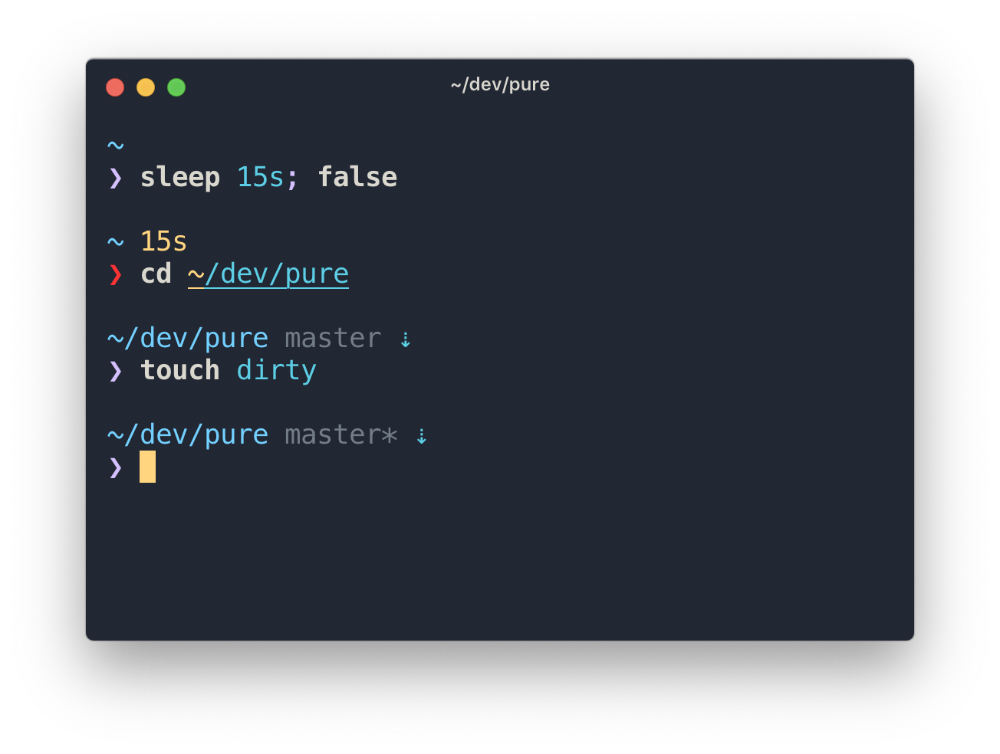

# Terminal basics


## What is the terminal?
Terminal is an interface for you to execute text-based commands, and it gives you direct access to the underlying operating system, via a shell, on your Mac. A long time ago, before computers had graphical user interfaces (GUIs), the only way to operate a computer was through the command line. Needing to run the computer through the command line helped users better understand what was going on inside their computer.

## Why use the terminal?
- Certain things simply cannot be done without the command line (especially as a developer). These include installing command line programs, using a git repository, browsing the filesystem, and so on.
- You can easily make changes to your computer's settings which would be tedious or even impossible to do using the user interface only.
- The terminal is very flexible, and once you learn to use it, it is quite simple and straightforward.
- It is a very direct way of telling your computer what to do, whereas a GUI is akin to controlling the computer from a distance.

[source](https://code.tutsplus.com/tutorials/command-line-basics-and-useful-tricks-with-the-terminal--cms-29356)

## Help
Always refer to documentation when in doubt, which is a google search away.
Always refer to the `commandname --help` menu or the manpage for a given command with `man commandname` for any command name.  
_Note:_ this guide is intended for Unix based systems, not Windows.

## Intro
Then you open the terminal, this is the first text that shows up. This is called a prompt.

```bash
bash-3.2$ 
```

The computer is now running a program called Bash, which is the default shell for the OSX operating system, since it runs on a Unix based kernel. The Unix operating system is a set of programs that act as a link between the computer and the user. Users communicate with the kernel through a program known as the shell. The shell is a command line interpreter; it translates commands entered by the user and converts them into a language that is understood by the kernel.


[source](https://www.tutorialspoint.com/unix/unix-getting-started.htm)

## Executing a command

The cursor is flashing meaning you can type a command and hit enter to execute it. Commands can be any combination of words, but they follow simple rules. One such word is "date".

```
bash-3.2$ date
Wed 19 May 2021 21:47:36 MDT
bash-3.2$ 
```

The date program will return the current date formatted as seen here. When browsing documentation and guides, often times they will not show the prompt in the sample code.

```
date
Wed 19 May 2021 21:47:36 MDT
```

## Anatomy of a command
The hard drive on the computer contains a collection of files and directories. On Unix based systems, there is a root directory at `/`. (windows uses drives like `C:\` and `D:\`) All absolute file paths start with the root directory such as `/Users/mateh/Documents/readme.txt`. Relative file paths are constructed using the current working directory.  
If the current directory is `/Users/mateh`, then the file path `Documents/readme.txt` or `./Documents/readme.txt` fill refer to `/Users/mateh/Documents/readme.txt`.

```bash
ls --help
ls: illegal option -- -
usage: ls [-@ABCFGHLOPRSTUWabcdefghiklmnopqrstuwx1%] [file ...]
```
When running `ls --help` the terminal gives us an error saying `ls: illegal option -- -` but then prints the usage for the command. The stuff in square brackets means that those parameters are optional.

```bash
ls -lsa
```
This command lists all files and directories including hidden files in the current directory, along with the files' permissions. `ls` is the program's name that is being executed, and `-lsa` are three parameters that are composed into one.
```bash
ls -l -s -a
```
is a longer way to type out the same command. However, sometimes we want to pass in arguments to the program. For example, the touch command will require one argument.
```bash
touch file.txt
```
In this case, name "file.txt" is any file name that we wish to create. It could have been "backup.bak" or "id_rsa.pub". Now if you run `ls` then you can see that "file.txt" has appeared in the current directory. Which directory? Running `pwd` will give you the answer. (pwd = Present Working Directory) Some programs will require two arguments, like the move command, which is also used for renaming files in place.

```bash
mv file.txt file-new.txt
```
Now if you run `ls` again then the file name has changed. Let's run the following command to make a new folder named "newfolder".
```bash
mkdir newfolder
```
Let's run `pwd` again to check the current directory.
```bash
cd newfolder
```
will change the current directory to the new folder. Run `pwd` again to check. Now we can move "file-new.txt" to here by running
```bash
mv ../file-new.txt ./
```
Here, `../` means one folder up from the current directory, and `./` means the current directory. The tilde `~` character is a shorthand for home directory, also defined in the `$HOME` environment variable(more on env vars later). On a mac it's `/Users/username`, on linux it's `/home/username`. This was the output of the first time you ran `pwd`, since every time you open a new terminal session, the default directory is the home directory. You can change this in `~/.bash_profile` along with many other things, or set the `$HOME` environment variable to something else when running `bash`. This applied to other shells as well, which is the next topic.

## Basic commands to know

```bash
touch file.txt
echo $SHELL
mkdir newfolder
cd newfolder
mv ../file.txt ./
chmod 755 file.txt
pwd
whoami
ls
la
nano file.txt
cat file.txt
cd ..
cd ../..
cd ~
open .
clear
sudo -s
say "Hello from the terminal"
exit
```

Run `commandname --help` or `man commandname` for more information about what these commands do, or google it.
Some commands like `nano` are special that it opens in a new window. Ctrl + X to exit, the menu is on the bottom. You can cancel a long running command with Ctrl + C. `vim` is a more advanced terminal based text editor. To quit it and discard changes, hit `ESC` then type `:q!` and hit Enter.   

## Pipe characters
There are special pipe characters that can be used to chain commands and direct the standard output:
```bash
echo "filecontents"
filecontents
```
This command will just output the text into the terminal. Also called standard output.
```bash
echo "filecontents" > file.txt
```
Instead of printing the text to the standard output, the text is now in file.txt. We can read back the data to the terminal's standard output with
```bash
cat file.txt
```
Other examples of pipe characters are `&&` and `|`.

## Bash scripts
Sometimes it's a pain in the butt having to type the same commands many times. That is why bash scripts exists, using the `.sh` extension.
```bash
echo "say hello" > hello.sh
chmod 755 hello.sh
./hello.sh
```
`chmod` modifies the permissions on the file so that the OS is allowed to execute it. More on permissions and `sudo` and the root user later.

## Shell environment

There are other shell programs that can run commands, such as zsh or fish. Let's install fish because it's awesome 🐟
Always refer to the documentation on how to install new command line programs such as fish.
First, check if homebrew is installed.
```bash
brew --version
```
Using the `--version` option is a common way to check if a program is installed and which version it is. If not installed (terminal says no command found), then install it like this:

```bash
/bin/bash -c "$(curl -fsSL https://raw.githubusercontent.com/Homebrew/install/master/install.sh)"
```

Now for the fun part
```bash
brew install fish
chsh -s /usr/bin/fish
curl -sL https://git.io/fisher | source && fisher install jorgebucaran/fisher
fisher install pure-fish/pure
exec $SHELL
```
If everything worked then the terminal prompt now looks like this


## Wrap up

That conculdes the basics, next I will cover how to log in to the VM using ssh, and perform any operation on the server using the freqtrade and docker CLI.